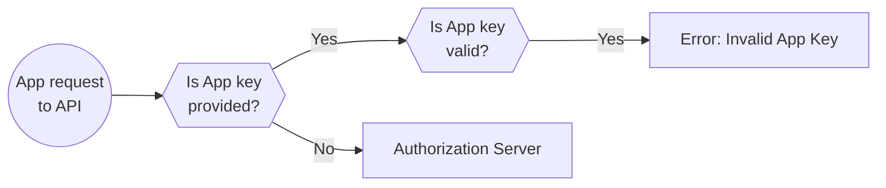

```mermaid
graph LR
    APP_REQUEST((App request<br>to API))
    APP_KEY_PROV{{Is App key<br>provided?}}
    APP_KEY_VALID{{Is App key<br>valid?}}
    AUTHZ_SERVER[Authorization Server]
    ERROR[Error: Invalid App Key]

    APP_REQUEST --> APP_KEY_PROV
    APP_KEY_PROV -->|Yes| APP_KEY_VALID
    APP_KEY_PROV -->|No| AUTHZ_SERVER
    APP_KEY_VALID -->|Yes| ERROR
```
